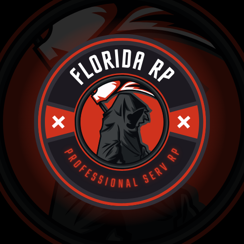

# — RÈGLEMENT FLORIDA RP —

&#x20;                                                               

_**— FLORIDA RP —**_

_**LEXIQUE**_

Chaque manquement à l’une de ces règles pourra entraîner un avertissement ou une sanction allant jusqu’au bannissement permanent de nos plateformes.

**Metagaming :**

_Le Metagaming, c’est le fait de récupérer et d’utiliser des informations hors Roleplay (Photos, Discussions, ou autres) en Roleplay, ce qui est interdit. Il est également interdit d’aller sur le stream d’un joueur du serveur lorsqu’on est en jeu sur le serveur_.

**Fear Roleplay :**

_Le Fear, c’est le fait de simuler la peur lors d’une scène Roleplay. Dans la vie réelle, tout le monde prend peur à la vue d'une arme braquée sur lui et écoute les instructions données par le braqueur !_

_Si vous sortez une arme ou bien que vous prenez la fuite alors que vous êtes braqué, cela constitue du NO FEAR, ce qui est interdit._

**Force Roleplay :**

_Le Force Roleplay, c’est d’obliger quelqu’un à aller dans votre sens. Personne ne doit faire quelque chose qu’il ne souhaite pas faire, et l’y obliger est interdit !_

**Free Kill :**

_Le Free Kill, c'est le fait de tuer un autre joueur sans raison valable, ce qui est interdit. Pour tuer quelqu’un il faut avoir une raison qui tient la route et qui s'inscrit dans la lignée de l'histoire que vous avez créé avec votre personnage._

**Powergaming :**

_Le Powergaming, en d'autres termes, désigne le fait de réaliser des actions totalement impossibles à faire dans la vraie vie grâce à la physique du jeu._

**Pain Roleplay :**

_Le Pain, c’est le fait de simuler la douleur qu’elle soit physique ou morale. La respecter implique d'accepter les effets d'une balle, d'un coup de batte ou bien d'une chute que peut recevoir votre personnage, ou bien l'effet qu'assister à une mort peut avoir sur votre mental. Ne pas simuler cette douleur correspond à faire du NO PAIN, ce qui est interdit !_

**Mass Roleplay :**

_Vous imaginez bien que les rues de Los Santos sont bondées de monde ! C'est tout le principe du Mass Roleplay puisqu'il demande aux joueurs de prendre en compte qu'une zone n'est pas vide malgré l'absence de joueurs._

**Raccourci Roleplay :**

_Le Raccourci Roleplay, c’est le fait de dire que quelqu’un appartient à tel ou tel groupe par sa couleur, sa voix ou encore ses caractéristiques physiques. De plus, reconnaître quelqu’un qui est masqué, en utilisant ces mêmes caractéristiques nommées ci-dessus est interdit !_

**Win Roleplay :**

_Le Win Roleplay, désigne le fait de vouloir gagner absolument la scène en cours par n’importe quel moyen et ne laisser aucune chance aux joueurs en face de vous ! Le Fair play est obligatoire, merci de le prendre en compte, quand vous êtes au pied du mur rendez vous !_

**Refus de scène :**

_Il est strictement interdit de ne pas jouer une scène jusqu’au bout ou d’éviter celle-ci. En cas de débordement, ou de non-respect du règlement, veillez à terminer votre scène comme si de rien était, et d’en avertir le staff dès que la scène est terminée._

**Bunny Hopping :**

_Le Bunny Hopping, c’est le fait de courir et sauter en même temps pour aller plus vite grâce à la méta du jeu. Pour éviter tout abus, le Bunny Hopping est interdit._

**Chicken Run :**

_Le Chiken Run, c’est le fait de courir et faire des zigzag en même temps pour esquiver des balles. Le Chicken Run est interdit._

**Car Kill :**

_Le Car kill, c’est le fait de prendre un véhicule et écraser/tuer une personne sans raison valable. Tout comme les Free Kill, c’est interdit !_

**Mix Roleplay :**

_Le Mix Roleplay, c’est le fait de parler en utilisant un langage Roleplay et Hors Roleplay en même temps. Le Mix Roleplay est interdit._

**Sniffing :**

_Le sniffing est le fait de fouiller la ville a la recherche des points illégaux tels que les points de drogue ou autres, il est interdit sur le serveur d’utiliser cette technique, vous pouvez utiliser uniquement les point obtenu de façon RP_

**Retour Zone/Quartier :**

_Le retour sur zone, peu importe votre raison, est strictement interdit. Vous devez attendre la fin de l’action Roleplay avant de revenir sur la zone où celle-ci se déroule, aussi bien pour l'illégale que le légal._

**Straffing :**

_Le straffing est le fait de se déplacer latéralement sans pivoter, comme sur des jeux compétitifs style CSGO, Valorant…, ce qui est interdit._

**Speed-punch :**

_Le fait de usebug en tapant en courant un joueur ce qui permet de spam punch un joueur, ce qui relève du PowerGaming._

**Double-voc :**

_Il est interdit de parler via un channel discord lorsque vous êtes en jeu. Une fois que vous êtes en jeu, vos seuls moyens de communication sont ceux utilisables en jeu._

**Cop Bait :**

_Il est interdit de provoquer intentionnellement les forces de l’ordre pour rien._

**TERMES ROLEPLAY**

**Reboot :**

_Si le serveur fait un reboot, beaucoup de joueurs parlent alors d'une "tempête" qui frappe la ville._

**AFK :**

_En cas d'AFK, il est toujours mieux de dire que vous étiez "dans vos pensées" ou bien que vous avez eu "un moment d'absence"._

**Crash :**

_Il peut arriver que votre jeu crash. Si c'est le cas, vous pouvez dire que vous avez été victime d'un "mal de crâne" ou d'une "migraine"._

**Micro :**

_Les problèmes de micro sont récurrents. Si vous rencontrez quelqu'un qui en a un prévenez-le en indiquant qu'il a "un problème à la gorge" et qu'il faudrait qu'il "prenne une pastille" par exemple. Ainsi, il saura que son micro n'est pas bien réglé._

**Discord :**

_Pour parler de Discord alors que vous êtes en jeu préférez dire que vous allez sur "l'intranet" ce qui permet d'exclure les ambiguïtés possibles avec le téléphone et la radio._

**GÉNÉRAL**

Chaque manquement à l’une de ces règles pourra entraîner un avertissement ou une sanction allant jusqu’au bannissement permanent de nos plateformes.

_**Le Fair Play sur ”FLORIDA RP“ est une chose à laquelle nous tenons énormément. Nous demandons à tous nos joueurs, qu’ils soient de la police, un simple citoyen, ou un membre de groupe de toujours être Fairplay. Le but n’est pas de gagner à chaque fois, mais bien de faire des scènes agréables pour tout le monde. Dans cette optique, laissez toujours une porte de sortie à la personne en face de vous. L’impact de vos décisions et actions Roleplay aura forcément un impact sur votre réputation et sur le regard des autres à votre encontre. Si vous voulez proposer de belles scènes et être respecté pour ça, faites en sorte de toujours jouer Fair Play.**_

Art. 1 - _Il est strictement interdit d’avoir des propos racistes, homophobes, sexistes ou discriminatoires_.

Art. 2 - _Aucune publicité n'est acceptée. Des sanctions peuvent s’ensuivre._

Art. 3 - _Si vous constatez un manque de Roleplay ou qu’une personne ne respecte pas le règlement, finissez votre scène le plus proprement possible. Une fois votre scène finie, venez en support._

Art. 4 - _Mettre un nom et prénom Roleplay sur steam ou FiveM est obligatoire afin de faciliter le travail de modération. Tout manquement est passible d’un kick puis d’un ban._

Art. 5 - _Toute action Roleplay ayant été interrompue par un reboot ou un crash doit continuer après ceux-ci. Il est également interdit de quitter une scène par un ALT+F4 ou autre. Pas d’échappatoire pour les opportunistes, sous peine de sanctions._

Art. 6 - _Il est interdit de recevoir les biens (véhicules, argent, objets en tout genre) de quelqu’un qui envisage un wipe ou son départ du serveur. De la même façon, l’ouverture d’un litige sur paypal ou sur une autre plateforme pour être remboursé d’une donation effectuée est passible d’un ban permanent de toutes nos plateformes._

Art. 7 - _Il est interdit de vendre les véhicules achetés sur la boutique (IRL) dans le but d’en transférer la propriété. Le fait de mettre dans un garage un véhicule import dans le but de le partager de manière récurrente avec un autre joueur est également interdit._

Art. 8 - _Le Roleplay-Sexe sous toutes ses formes est interdit, et est passibles de bannissement définitif sans négociation._

Art. 9 - _Interdiction de jeter des items lorsqu’on se fait braquer._

Art. 10 - _Lorsque vous souhaitez envoyer un mail Roleplay à une personne quelconque, vous devez au préalable obtenir son adresse de manière Roleplay._

Art. 11 - _Lorsque vous n’avez plus de téléphone ni de radio, vous n’avez plus accès aux canaux Discord Roleplay écrit comme vocal._

Art. 12 - _Les “insultes” et la “répartie” sont tolérées, mais n’oubliez pas qu’il y a un joueur derrière le personnage Roleplay et que nous ne connaissons pas sa vie. Le respect avant tout !_

Art. 13 - _Si vous prévoyez de tuer un joueur bien précis dans le cadre de votre Roleplay, votre revendication doit être claire. Le background et le contexte doivent être connus par la modération (faire un ticket pour un dossier de Mort Roleplay). Sauf si, en tant que lead de groupe, vous souhaitez Mort RP un de vos membres._

Art. 14 - _Les avatars au physique volontairement "Troll" seront sanctionnés._

Art. 15 - _Les modificateurs de voix sont interdits_.

Art. 16 - _Faire un métier des forces de l'ordre, ou du service public, pour ensuite travailler dans l’illégal n’est pas cohérent. Un wype est obligatoire entre les deux (et inversement)._

Art. 17 - _Le LSMS, en coopération avec le Staff, se réserve le droit de faire une Mort Roleplay sans dossier en cas de plusieurs comas/blessures lourdes répétées._

Art. 18 - _Dans le cas où vous possédez un ou plusieurs véhicules boutique, vous êtes autorisé à récupérer ces mêmes véhicules après votre wipe._

Art. 19 - _Le LSMS n'a pas le droit de vendre de bandages ou des kits de soins aux autres joueurs._

Art. 20 - _Il est fortement déconseillé aux citoyens de se rendre dans un quartier de gang, organisation etc… sans y être invité. C’est à vous d’assumer les conséquences qui pourraient arriver._

Art. 21 - _Le LSPD n’a pas le droit de procéder à une fouille pour un simple contrôle de routine et sans raison valable. Seul un DEFCON peut changer ce comportement._\
\
Art. 22 - _Il est strictement interdit de faire des manifestations/de faire grève en RP pour des problèmes qui doivent se régler en HRP ou qui se sont créés par des réglementations HRP, sous peine de sanction_.

Art. 23 - _Les dossiers ripoux sont soumis à la validation du staff et du responsable en charge des projets FDO._

Art. 24 - _Un individu mit en cellule doit être obligatoirement en tout temps être accompagné par au moins un agent de police._

**MASS ROLEPLAY**

Chaque manquement à l’une de ces règles pourra entraîner un avertissement ou une sanction allant jusqu’au bannissement permanent de nos plateformes.

Art. 1 - **Poste de Police**

Art. 2 - **Hôpital**

Art. 3 - **City Hall (Gouvernement)**

**ENTREPRISE**

Chaque manquement à l’une de ces règles pourra entraîner un avertissement ou une sanction allant jusqu’au bannissement permanent de nos plateformes.

Art. 1 - _Si un patron et/ou un co-patron prend une grosse sanction, ou si le contrat\* n’est pas respecté, le staff se réserve le choix selon les explications de lui retirer ou non sa société._\

**\*Le contrat consiste en le respect de réaliser au minimum 2-3 évènements par mois, être présent régulièrement en ouvrant 5 fois par semaine l’entreprise, être au minimum deux dans l’entreprise (patron & co-patron) et en collaborant avec les autres entreprises. Si l’entreprise est fermée sans gestion pendant 1 mois, l’entreprise est retirée.**

Art. 2 - _Il est obligatoire de travailler en tenue et avec son véhicule de service._

Art. 3 - _Chaque joueur ne peut gérer ou posséder qu’une et une seule entreprise en ville._

Art. 4 - _Vous ne pouvez pas retirer l’argent de votre entreprise par pur plaisir. Chaque semaine, les caisses seront contrôlées par le gouvernement et les joueurs seront chargés de rembourser tout manquement par rapport à leur comptabilité._

_La phrase secrète est « Vivien kiff les pâtes »._

Art. 5 - _La comptabilité doit être à jour à chaque fin de semaine._

Art. 6 - _Veuillez utiliser des véhicules cohérents (camionnette, camion) pour remplir vos stocks, sous peine de sanction._

Art. 7 - _Chaque patron s’expose à une perte immédiate de leur entreprise dans le cas où ils se feraient arrêter pour un délit ou un crime. Il y a un degré_ _de tolérance différent pour chaque type d’entreprise (restaurant/évènement, service). Le patronat du Benny’s/LS Customs et du Dynasty8 sont des entreprises strictement réservées à un background de personnage légal. Tout manquement peut mener à une sanction._

**COMA**

Chaque manquement à l’une de ces règles pourra entraîner un avertissement ou une sanction allant jusqu’au bannissement permanent de nos plateformes.

Art. 1 - _Les poings : Une simple bagarre, vous prenez un choc, vous êtes un peu faible mais vous vous souvenez de la scène et de ce qui a amené à cette dernière._

Art. 2 - _Couteau, cran d’arrêt et autres armes contondantes : La blessure est très sérieuse (à adapter en fonction de l’arme blanche évidemment), le joueur mettra du temps à se souvenir de la scène et celle-ci restera légèrement flou après la réanimation par le LSMS. (Il hésite quand a confirmé si c’est bien cette personne X qui lui à fait ça)_

_(Prise en charge LSMS)_

Art. 3 - _Arme à feu: Une blessure importante est présente sur votre personnage, qui ne se souvient pas de qui l’a agressé mais de la forme de l’action et de certains gros détails. Vous savez que vous avez eu un conflit avec un groupe mais vous êtes incapable de dire qui exactement. Seuls certains détails comme les vêtements, une phrase marquante, caractéristique physique, restent. (Prise en charge LSMS)_

Art. 4 - _Unité X : La scène doit entièrement être oubliée si vous êtes pris en charge par l’unité X. (Sauf pour les poings, cf. Art. 1)_

Art. 5 - _Etre coma à plusieurs reprises par une arme à feu entraînera à coup sur une Mort RolePlay à votre personnage. Tout agissement de NO FEAR face à une arme à feu, peut entraîner une Mort Roleplay imposée par le staff de FLORIDA RP !_

Art. 6 - _Il est bien entendu interdit de parler, d’écouter, de répondre, de communiquer par n’importe quelle manière que ce soit lorsque vous êtes en coma. Il est également interdit d’écouter et prendre en compte en RP des informations lorsque vous êtes coma. Des sanctions seront appliquées._

Art. 7- _Un /me indiquant la raison de l’accident, l’endroit où vous avez mal etc.. est obligatoire et aide grandement le LSMS à appliquer un Roleplay cohérent !_

Art. 8 - _K.O : Être K.O signifie que vous êtes tombé après avoir reçu un coup. Lorsque vous vous relevez, jouez en conséquence (mal de tête, feindre d’être sonné, etc…). Si vous êtes en fight illégale, impossible de repartir vous battre._

Art. 9 - _Un ITT (incapacité temporaire de travail) ne peut pas être supérieure à 24h. Un ITT doit être joué de manière cohérente (boiter, ne pas courir, chaise roulante si cas échéant, et bien évidemment ne pas participer à un combat pendant cette période). Un combat sans arme à feu ou arme contondante ne peut pas mener à un ITT supérieur à 12h._

**ILLÉGAL**

Chaque manquement à l’une de ces règles pourra entraîner un avertissement ou une sanction allant jusqu’au bannissement permanent de nos plateformes.

Art. 1 - Il est interdit d’utiliser des véhicules importés pour des scènes illégales de n’importe quelle nature que ce soit à partir du moment où vous avez quelque chose à vous reprocher (sauf si vous êtes embarqué dans une scène _à votre insu_).

Art. 2 - Mettre une personne en coma après un enlèvement sans bonnes raisons n’est pas FairPlay.

Art. 3 - Les braquages répétitifs de citoyens dans l'intention de les dépouiller sans aucune raison, quel que soit le lieu est interdit. Il est important de favoriser les actions Roleplay & Fair play au lieu de chercher à dégoûter les gens en leur volant systématiquement des heures de farm.

Art. 4 - Le racket est autorisé, mais vous n’êtes pas autorisé à prendre 100% de la marchandise. Vous ne pouvez dérober que 50% des possessions, sauf si la personne en face ne joue pas son Fear Roleplay et/ou refuse de coopérer.

Art. 5 - Il n’est cependant pas autorisé de faire du FARM de racket des autres joueurs, sous peine de sanctions.

Art. 6 - Braquer un agent des forces de l’ordre pour récupérer ses armes sur lui ou dans son véhicule est strictement interdit.

Art. 7 - Après une rixe, il est interdit de récupérer des objets sur les personnes à terre.

Art. 8 - Si vous êtes un preneur d'otage, il est interdit de prendre la radio et le téléphone oralement, il faut obligatoirement la lui prendre de ses poches !

Art. 9 - Il est strictement interdit de braquer quelqu’un au distributeur à billet ou de forcer quelqu’un à sortir de l’argent de son compte bancaire. Il est également interdit de forcer un joueur à vous céder le contenu de son coffre d’appartement ou les clés de son véhicule.

Art. 10 - Obligation d'attendre les forces de l'ordre au moins 10 minutes lors d’un braquage.

Art. 11 - La création d’un groupe officiel se demande au staff avec un dossier fait par Google Docs soumis en support ticket, ce dernier sera voté par l’ensemble du staff. Cette demande ne peut intervenir que lorsque les joueurs qui la formulent sont au nombre de 8, peu importe le type de faction, et présents et actifs sur le serveur depuis assez longtemps pour que les membres du staff aient connaissance de leur sérieux et de leur implication (2 semaines minimum).

Art. 12 - Un groupe illégal se compose de 20 membres maximum peu importe le type de faction. Vous avez le droit d'avoir au tant d'habitant que vous souhait mais il n'ont pas le droit de prendre part dans les actions de votre groupe

Art. 13 - Il est interdit d’entreprendre une action illégale 30 minutes avant un reboot et 30 minutes après.

Art. 14 - Les PIT sont interdits, peu importe les circonstances ou les factions engagées.

Art. 15 - Le Drive-By en course poursuite est interdit, peu importe les circonstances ou les factions engagées.

Art. 16 - Les otages complices sont formellement interdits.

Art. 17 - Lors d’une scène de torture vous êtes dans l’obligation de donner quelques informations, sinon vous vous exposez à une Mort Roleplay suivi d’un avertissement.

Art. 18 - Pour effectuer une prise d’otage, vous devez être minimum 2, et ne pouvez demander que 4000$ maximum par otage (maximum ne veux pas dire systématique). Laissez une possibilité de négociation, sous peine de sanction.

Art. 19 - Supérette : Entre 1 et 4 personnes et un véhicule 4 places du lore GTA au maximum pour l’effectuer sans otage. Seuls les gains du coffre de Apu sont bénéfiques. Apu ne compte pas comme étant un otage. Aucun plan d’aucune nature particulière n’est toléré. Il est obligatoire d’avoir au moins une arme blanche pour effectuer un braquage de supérette.

\
Art. 20 - Les braquages d’ATM et les cambriolages de maisons sont faisables uniquement en véhicule 4 places du lore GTA.

Art. 21 - Fleeca : 4 personnes minimum et 6 personnes maximum (5 à 7 joueurs pour la Fleeca Paleto) pour l’effectuer avec 3 otages (4 pour la Fleeca Paleto). Une Fleeca ou une Fleeca paleto maximum par semaine et par groupe avec un délai de une semaine entre chaque braquage. Deux véhicules maximum autorisés sur le braquage, et doivent être des véhicules GTA (non-import). Le plan mule est STRICTEMENT INTERDIT (privilégiez le Fair-Play). Il est nécessaire d’avoir au minimum 2 armes à feu de poing pour tenter un braquage de fleeca. Le LSPD doit obligatoirement avoir une fenêtre de négociation (Fair-Play).

Art. 22 - Bijouterie : 3 personnes minimum et 5 personnes maximum pour l’effectuer avec 2 otages minimum. Une bijouterie maximum par semaine et par groupe. Il est nécessaire d’avoir au minimum une arme de poing par braqueur dont 1 pistolet MK2 pour tenter un braquage de bijouterie. Le LSPD doit obligatoirement avoir une fenêtre de négociation (Fair-Play).

Art. 23 - Pacific Bank : 10 personnes minimum pour l’effectuer avec 6 ou 7 otages. Une pacific bank maximum tous les deux mois et par groupe. Le plan mule est toléré mais s’il y des abus des sanction vont tomber, Il est nécessaire d’avoir au minimum 8 armes à feu de poing et une arme lourde pour tenter un braquage de pacific. Le LSPD doit obligatoirement avoir une fenêtre de négociation (Fair-Play). Attention la Mort RP est activée ou de lourdes conséquences peuvent être appliquées à votre personnage ou groupe.

Art. 24 - Faites preuve de Fair Play lors de vos négociations et ne cherchez pas à faire du Win Roleplay, peu importe l’issue.

Art. 25 - Lorsque vous réglez une scène entre gang, vous devez favoriser les armes combat à mains nus ou les armes de mêlée (batte de baseball, poing américain…).

Art. 26 - Toute personne partant et/ou trahissant un gang dans lequel elle était s’expose à une Mort Roleplay par ceux-ci (Prévenir le staff par un ticket au préalable).

Art. 27 - Il est interdit d’entreprendre une action illégale (vente de drogue PNJ, braquages, prise d’otages…) avec un véhicule non cohérent et une/des motos/vélos/skateboard.

Art. 28 - Les runs de drogues sont interdits avec un véhicule d’entreprise.

Art. 29 - 1 - Revenir en tant que le “fils de” ou le “cousin de” pour se venger ou acquérir un bien est interdit, ou doit être d’abord accepté par l’administration. Votre nouveau personnage ne doit pas avoir de lien avec l’ancien.

Art. 29 - 2 - Un wipe ne permet pas de retourner à son ancienne condition (groupe criminel / Entreprise / Cercle social).

Art. 30- Il y a quatres zones interdites qui ne sont pas accessibles sans autorisation explicites, qui sont : l’Aéroport International, la Prison, le Porte Avion et le Fort Zancudo (Base militaire).

Art. 31 - Vous êtes dans l’obligation de respecter le Fear LSPD. L’illégal doit craindre la police. Privilégiez le Fair-Play.

Art. 32 - Aucune alliance n’est tolérée pour les actions criminelles, une entente peut se faire pour des cas de Mort RP ou scène spécifiques à faire valider en amont par le staff, cependant une entente est tolérée entre groupes pour échanger des informations au mieux ou de se faire la paix par exemple, mais aucune action communes n’est tolérée pour des enlèvements, des descentes sur des quartiers, des règlements de comptes ou tout types d’actions dans le même genre.

Si 2 actions distinctes s’entre croisent en même temps avec un ennemi commun aux deux, à vous d’estimer si le Fair Play est garanti en la continuant ou non dans les conditions actuelles (le Staff peut se réserver le droit de vous refuser certaines scènes si le “hasard” n’en est pas un ou si le Fair Play n’est pas garanti). Le but étant bien évidemment de rendre l'expérience la plus agréable possible pour tout le monde et éviter les incohérences qui pourraient en découler.

Art. 35 - Pour effectuer une prise d’otage, vous devez avoir au minimum une arme à feu pour 2 otages. Chaque otage doit être géré par deux personnes au minimum. Veuillez également prendre en compte que du NoFear peut se transformer en une Mort RP en plus de la sanction HRP. Respectez au maximum la cohérence et le Fear LSPD.

Art. 36 - Le contre-braquage est autorisé jusqu’à 2 secondes après que l’arme soit pointée sur le joueur en 1V1. Un contre-braqueur s’expose à un risque de se prendre une balle et de tomber coma.

Art. 37 - La méta convoi est limitée au maximum à 2 véhicules lors d’un convoi. Les MC ne sont pas concernés par cette limitation.

Art. 38 - Un WARN de groupe peut être appliqué lors d’une scène par l’équipe de modération. Au bout de 2 WARN de groupe, c’est Disband puis BAN suivant les dispositions prises par l’équipe de modération.

_**FONCTIONNEMENTS :**_

\
**Règlement pour une guerre entre groupe :**

Une guerre doit être contrôlée par vous-même en étant fair-play et réaliste et validé par le staff.

Il est interdit d’initier des grosses scènes illégales sur une guerre à partir de 3h du matin (heure Française). Toutes les scènes commencées aprés ces horaires pourront être terminées.

Pour déclarer une guerre à un groupe il faut qu'un rendez-vous soit fait avec une revendication et les causes valables de cette guerre et informé sur votre ticket d’une déclaration de guerre avec les raisons.

Le déroulement de cette guerre elle passe par plusieurs étapes avant d'arriver au but ultime

Descente par arme blanche : Règlement de compte à l’arme blanche, pas plus de deux descentes par groupe avec un délai de 72H d’intervalle sur chaque attaque. Si une descente est ratée, il est interdit de refaire une descente. Il faut attendre le délai de 72h

Drive-By : C'est un drive by par faction toutes les 72h . Maximum 2 shooters. Interdiction de descendre du véhicule, tout doit se faire dans le véhicule. Lors d'un drive-by , le conducteur ne doit pas être un shooter. Si lors d'un drive-by ou descente vous êtes touché vous ne pourrez pas participer pendant 24h à n'importe quelle drive-by / GetBack / descente.

Get Back : C’est une réponse à un drive-by ils ont 24 heures pour répliquer.

Kidnapping : C’est une par faction toutes les 72h. Maximum 2 personnes peut être enlevé par groupe.

Descente à l’arme létale :Règlement de compte à l’arme létale pas plus de deux descentes par groupe avec un délai de 72h et cette descente doit être faite quand les étapes de cette guerre on était réalisé c’est à dire Descente arme blanche/Drive by/Kidnapping.

Si vous vous faites tirer dessus, vous avez le droit de répliquer. (soyez réaliste et cohérent)

Lorsque des tirs ont lieu, vous avez 30 secondes max pour quitter les lieux à partir du premier coup de feu.

Il est interdit de déclencher une fusillade sans avoir eu un échange verbal. Cet échange ne peut pas être une sommation. L'échange doit être une négociation. Cette négociation ne peut pas être faite depuis un véhicule. La négociation doit être fairplay et doit potentiellement faire plaisir aux deux parties.

Il est interdit de prendre des positions avant de déclencher le premier tir.

**Guerre de territoire de drogue** :

Les groupes doivent déclarer la guerre à leur ennemi de façon CLAIRE et OFFICIELLE en rp pour les territoires concernés.

Ils nous doivent de nous faire parvenir dans leur TICKET ILLEGAL lorsqu'une GUERRE est déclenchée avec un autre GROUPE (juste pour qu'on soit au courant des mouvements du plateau de jeu)

Déroulement de cette guerre

Dans un premier temps, elles se doivent d'être faites de manière modérée et elles s'accentuent au fil du temps. Première approche ; discussion en RP afin de trouver un terrain d'entente ce qui n'est pas le cas une guerre peut s'ouvrir sous forme de bagarre à nombre égale bien sur ce qui va ouvrir les hostilités. Le groupe qui gagne garde le terrain pour 72 heures et le groupe adverse peut venir contester ce terrain à la fin du délai. Attention quand deux groupes entrent en guerre pour un terrain les autres ne peuvent intervenir ils devront aller chercher d'autre terrain pendant cette guerre premier arrivé premier servi. Cette guerre dure une semaine maximum ! Quand le délai des 72h est passé la guerre est en cours deuxième étape : le groupe qui souhaite venir récupérer le terrain peut faire une attaque à l'arme blanche uniquement.

Elle se doit d'être revendue de façon RP et pas juste arriver sur les lieux et planter tout le monde. Le but est que le groupe qui défend le terrain puisse venir sur le lieu et défendre leur terrain contre les attaquants. (modifié)

Même principe, les groupes qui gagnent le terrain le garde pour 72 heures. Dernière ligne droite afin de gagner cette guerre est conservé le terrain pour un délai de 4 jours. Dernière étape guerre ouverte qui va durer 72 heures libre choix au groupe de gérer la façon qu'il va gagner cette guerre c'est à dire elle se passe par plusieurs façon kidnapping / fusillade/drive by /revendication des fait qui fera mettre le genou au sol afin de gagner cette guerre si aucun des groupes ne souhaite joue le jeu en rp le staff prendra la décision de qui récupéra le terrain selon les actes.

Une GUERRE est déclarée TERMINÉE soit par la FIN D'UN DES GROUPES EN GUERRE, soit par UNE PAIX OFFICIELLE entre les différents partis. Il y aura toujours un PERDANT et un GAGNANT, même au moment de la négociation de PAIX. Ne faites PAS LA GUERRE si vous n'êtes pas capable d'assumer une FIN DE GROUPE est probable. Les GROUPES MINEURS ET/OU SECONDAIRES peuvent faire des GUERRES DE TERRITOIRE a des groupes officiels.

**Braquage d’entreprise :**

Dans le but de favoriser les scènes entre l’illégal et les entreprises, vous avez la possibilité de braquer, en groupe de **4 personnes à 6 personnes** avec **au moins deux armes à feu**, une entreprise du serveur. Vous aurez la possibilité de prendre jusqu’à **deux otages à l’intérieur de l’enceinte de l’entreprise lors du braquage et libérer tous les autres.** Si le patron n’est pas présent lors du braquage, vous devez continuer la scène en particulier si vous avez des otages. **Chaque otage doit valoir au maximum 5k lors d’un braquage d’entreprise.** Laissez une marge de négociation. **Un groupe ne peut pas braquer deux semaines de suite la même entreprise et ne peut effectuer un braquage d’entreprise qu’une seule fois par semaine.** Vous pouvez demander, dans le cas d’une **entreprise de farm (Bennys, Dynasty8 et LS Customs inclus), jusqu’à 20k** des coffres de l’entreprise uniquement, dans le cas d’une **entreprise de restauration jusqu’à 10k et 10 menus** des coffres de l’entreprise et **jusqu’à 10k pour les entreprises de services** autres que celles mentionnées. Les braquages d’entreprise ont lieu entre **21h30 et 02h30 uniquement**. Vous devez rester sur les lieux de la scène pendant **20mn** pour laisser le temps à la **police d’arriver sur les lieux**. _**De plus, il est strictement interdit de braquer une entreprise si celle-ci accueille un évènement.**_

Note : Une coopération avec le Gruppe6 est autorisée ainsi qu’avec les groupes illégaux pour sécuriser l’entreprise. Les entreprises auront des moyens déployés par le gouvernement pour garantir la majorité de leurs pertes causées par un braquage. Évitez les abus sous peine de voir les règles plus contraignantes.

**Le règlement est à connaître dans sa globalité mais ne stressez pas en douane, tout se passera bien. Les fonctionnements sont exclus des entretiens Whitelist mais sont à connaître.**
